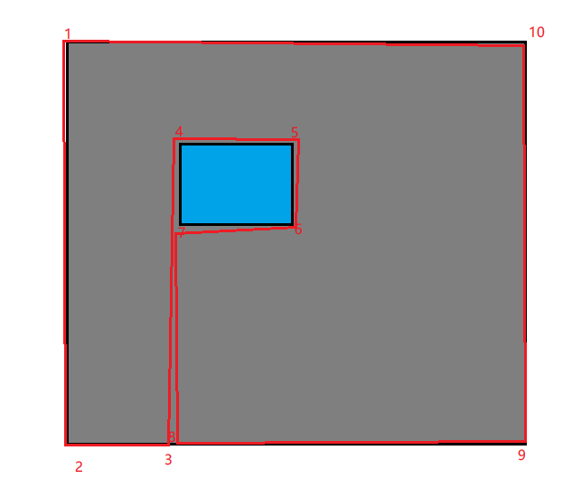

很多操作比较复杂的应用在用户第一次打开时会出现用户引导以便用户可以快速上手，一般在手机应用和游戏中比较常见，例如：


一般都是利用遮罩层遮挡住整个屏幕，然后定位到相应的元素，并将目标元素高亮，在周围放置提示语。
但是这样做的缺点时用户无法与目标元素互动，为了解决这个问题，我们可以利用 css3 所提供的 [`clip-path`](https://developer.mozilla.org/zh-CN/docs/web/css/clip-path) 属性，可以将我们的遮罩层剪裁出我们想要的图形。

  
如图所示，我们可以使用 `polygn` 画出一个多边形，依次从图中标记的点中经过，最终得出想要的遮罩层。  
其中1、2、9、10的位置就是视图的四个顶点，而3、4、5、6、7、8则需要根据目标元素的位置计算得出。
```js
const item = document.querySelector('item');
const rect = item.getBoundingClientRect();
const mask = document.querySelector('.mask');
const {
  width, height, x, y,
} = rect;

const path =  `polygon(
    0 0,
    0 100vh,
    ${x}px 100vh,
    ${x}px ${y}px,
    ${x + width}px ${y}px,
    ${x + width}px ${y + height}px,
    ${x}px ${y + height}px,
    ${x}px 100vh,
    100vw 100vh,
    100vw 0
)`;

mask.style.clipPath = path;
```

> [Mask with highlight](https://codepen.io/cuzfinal/pen/abZaMeb)
